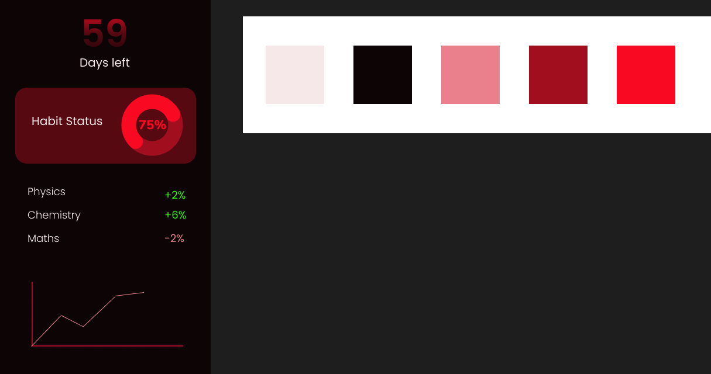

<h1 align="center"> Eval You 🔍 </h1>
<h3 align="center"><samp>A minimalistic app to keep track of exam preparation </samp></h3>
 
 

<samp>The plan</samp>

## 🏗 Dependenices:
- Flutter (w/ Material You)
- [fl_chart](https://pub.dev/packages/fl_chart) for line graph

## 🚲 Development cycle:

### Setup:
- [x] Setup the repo
- [x] Prepare design document
- [x] Create an initial app

### Stage 1:
- [x] Number of days remaining:
    - Calculate the remaining days till the exam date (1st April for now)
    - Show X days left

- [x] Create an UI mockup

- [x] Add summary 
    - [x] Setup Basic shape
    - ~~User configurable habit status [Good, needs improvement, bad]~~

### Stage 2:
- [x] Graph support
    - [x] setup the DAY-MARK line graph
    - [x] Populate it with data

### Stage 3: Improvement
- [ ] Rename the app
- [ ] Add a logo
- [ ] Cleanup dialogue and insights

### Stage 4: Open it up
- [ ] Make it user friendly and versatile (Allow changing exam date)
- [ ] Notification

