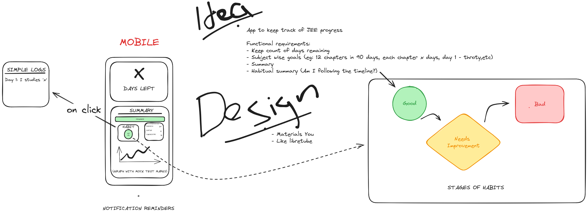

<h1 align="center"> Study Evaluation App 🔍 </h1>
<h3 align="center"><samp>A minimalistic app to keep track of exam preparation </samp></h3>
 
 

<samp>The plan</samp>

## 🏗 Dependenices:
- Flutter (w/ Material You)
- [Syncfusion Flutter Charts](https://pub.dev/packages/syncfusion_flutter_charts) for graph

## 🚲 Development cycle:

### Setup:
- [ x ] Setup the repo
- [ x ] Prepare design document
- [ x ] Create an initial app

### Stage 1:
- [ ] Number of days remaining:
    - Calculate the remaining days till the exam date (1st April for now)
    - Show X days left

- [ ] Add summary 
    - User configurable progress bar (for now) [allow increments of 25]
    - User configurable habit status [Good, needs improvement, bad]

### Stage 2:
- [ ] Graph support
    - DAY-MARK line graph

